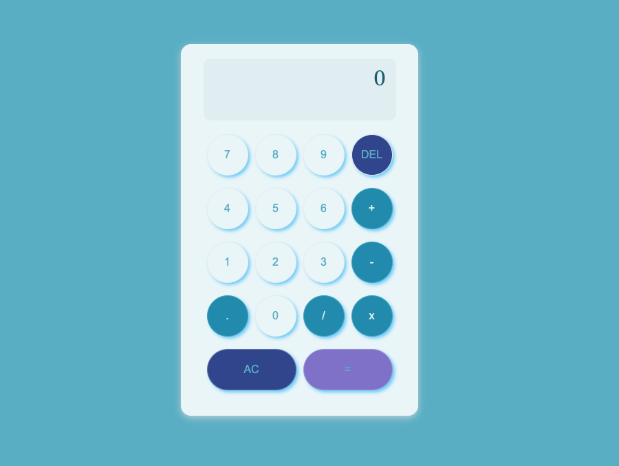

# React Calculator App

This is a calculator app, one of the projects in [freeCodeCamp](https://www.freecodecamp.org/learn/front-end-development-libraries/front-end-development-libraries-projects/build-a-javascript-calculator).

## Features

- Basic arithmetic operations: addition, subtraction, multiplication, and division
- Clear and reset functionalities
- Responsive design for mobile and desktop users
- User-friendly interface

## Demo

**You can try out the app [here](https://fcc-react-js-calculator-app.vercel.app/).**

## Technologies Used

- **React**
- **CSS**
- **[mathjs](https://www.npmjs.com/package/mathjs)**
